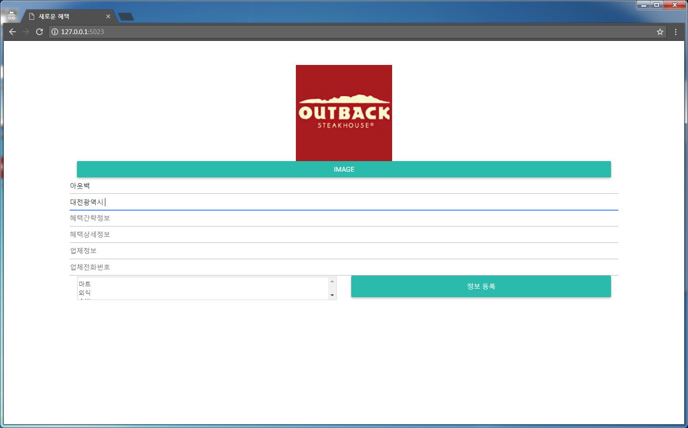
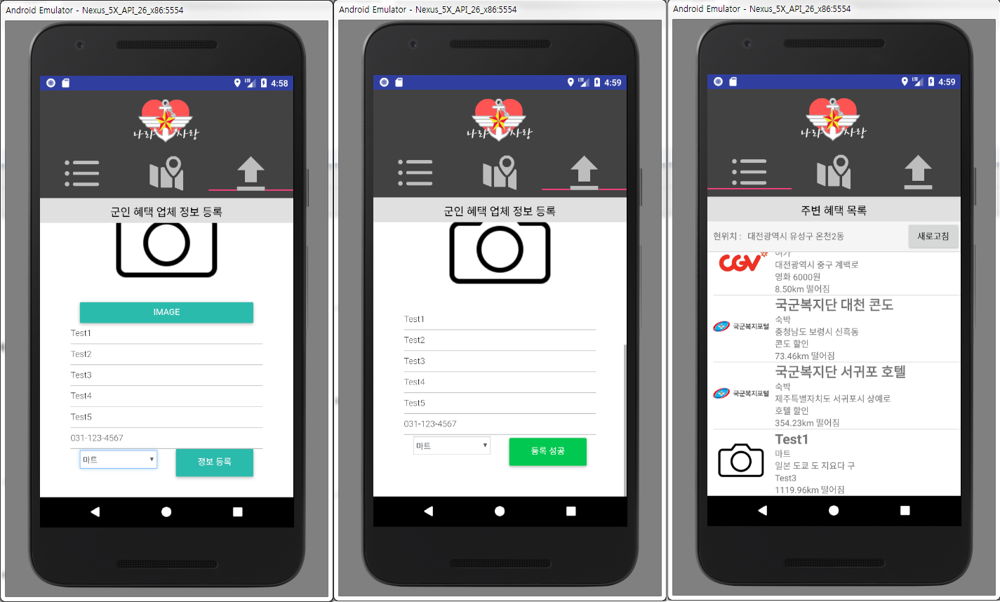
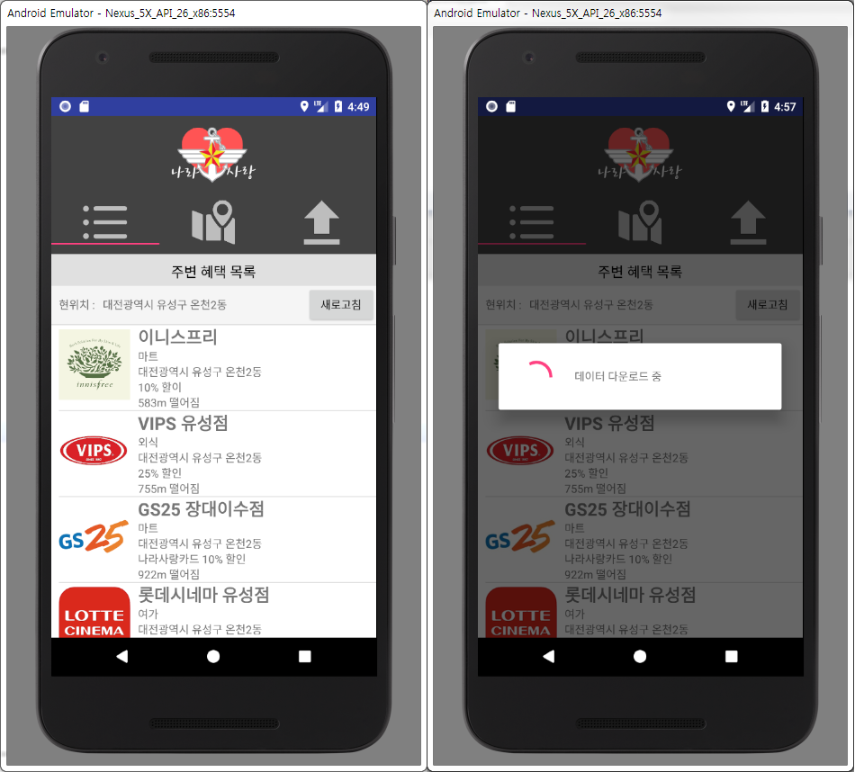
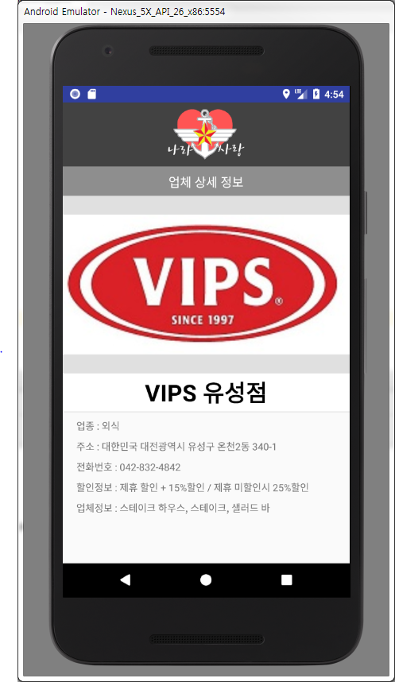
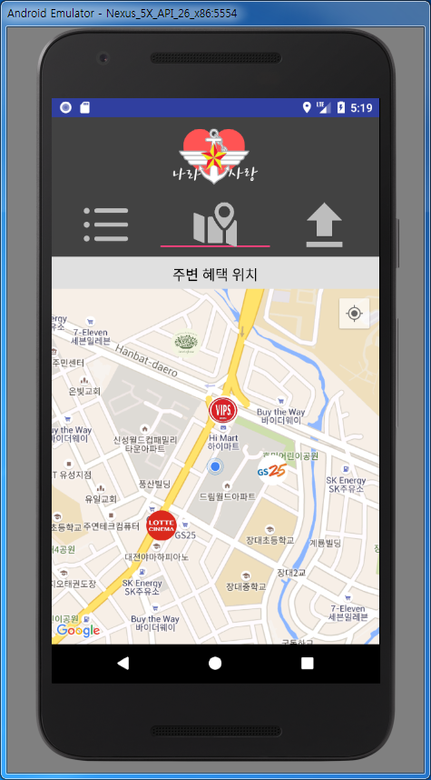
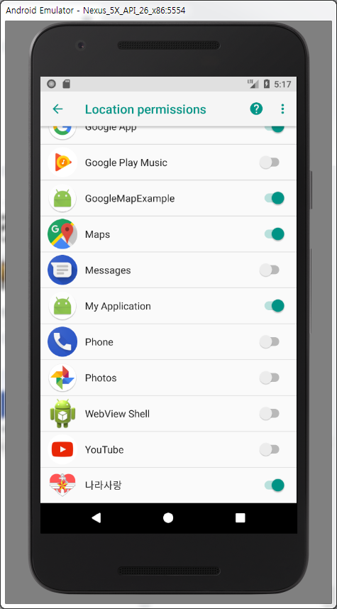
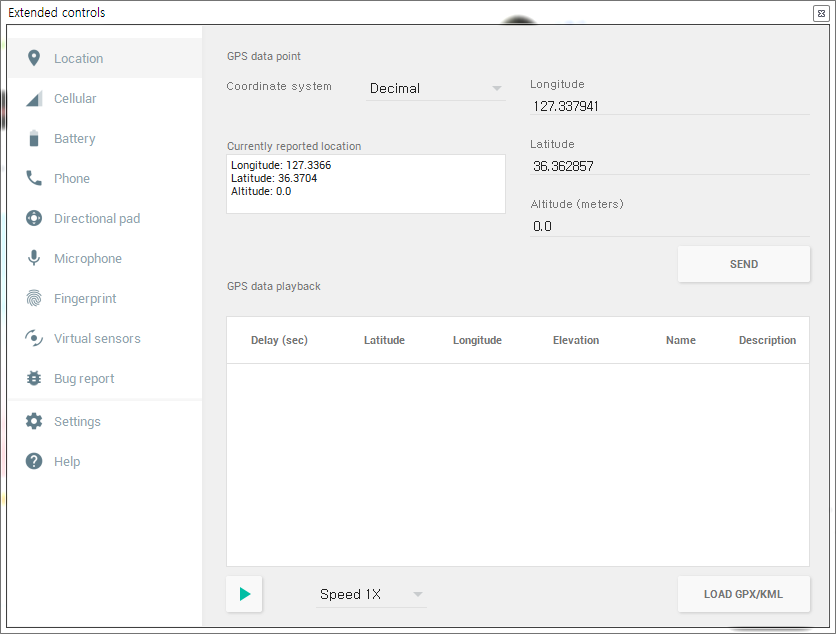

# **나라사랑**
- - - 

## **주제**
### ‘위치 기반 군 장병 혜택 조회·공유 어플리케이션’

## **개요**

> - 군 장병이 자신 주변의 혜택 시설(업체)를 확인하여 쉽게 이용 할 수 있고 민간 업체에서 직접 혜택과 위치 정보를 등록할 수 있게 하여 군 장병들이 현 위치로부터 주변의 더 많은 실질적인 혜택을 이용할 수 있도록 B2P (Business To Peer) 플랫폼을 제공합니다.

## **개발 배경**

> - 국방부와 민간업체(에버랜드, VIPS 등) 에서 군 장병들을 위한 혜택을 제공하고 있으나 종합적인 업체·시설 정보를 제공하는 곳이 없어 군 장병이 혜택을 이용하기에 어려운 점이 있어 혜택이 많이 이용되지 않습니다.
> - 군 장병에게 혜택을 제공하는 소규모 업체들이 있으나 정보를 능동적으로 제공할 수 있는 플랫폼이 없어 잘 알려지지 않고 이용하기도 어렵습니다.
> - 따라서 업체와 개인을 연결하는 B2P 플랫폼을 개발하게 되었습니다.

## **활용성**

> - 출타하여 이동하는 군장병이 자신의 위치를 기반으로 주변에 있는 업체들을 목록과 지도를 통해 거리순으로 손쉽게 확인할 수 있어 실제로 혜택을 이용할 수 있는 접근성이 대폭 상승합니다.
> - 소규모 업체들이 자신 지역의 군장병을 대상으로한 혜택을 등록하여 쉽게 홍보할 수 있게 되면서 고객층 확보가 쉬워집니다.
> - 업체들이 쉽게 혜택을 등록할 수 있게 되면서 다양한 헤택 제공이 늘어날 것이며 군 장병들이 기존에 알려진 프랜차이즈 업체 외에도 다방면으로 혜택을 누릴 수 있게됩니다.
> - 정보 등록이 용이하고 바로 정보를 확인할 수 있어 업체와 군장병들이 서로 혜택 정보를 공유하고 이용하며 상생하는 플랫폼으로서의 역할을 할 것입니다.

## **개발 효과**

> - 기존에 존재하던 헤택을 모아서 활용하는 것이므로 추가적인 지출 없이 60만명에 달하는 국군장병 전체의 복지 헤택이 상승하는 효과를 얻을 수 있습니다. 추가적으로 민간업체들의 대한민국의 전체 취업자 대비 자영업자 비중은 26.8%로 OECD 평균보다 1.7배 높음. 하지만 연평균 77만개 창업, 65만개 폐업이 이루어지고 있어 수명주기가 짧은 불안정한 환경을 가지고 있습니다. 프랜차이즈와 대기업과 달리 효과적인 홍보 수단이 없는 소상공인들이 해당 어플리케이션을 통해 60만 군장병에게 쉽게 홍보할 수 있는 수단이 생김으로서 대한민국의 소상공인 환경에 긍정적인 영향을 미칠 것으로 예상합니다.
> - 해당 어플리케이션을 군 장병들이 사용하게 될 경우 국방부에서 추진하는 새로운 복지정책이나 혜택을 쉽게 전파하고 이용하도록 할 수 있게되어 국방부와 장병사이의 정보 전달이 용이해질 것입니다.

## **결론**

> - 해당 어플리케이션을 통해 다양하게 늘어난 혜택을 편리하게 이용할 수 있게 되면서 군장병 전체의 복지가 증대될 것이며 대한민국의 소상공인들과 내수시장에도 긍정적인 영향을 미칠 것입니다.

## **기능 설명**

> - 본 서비스를 통해 군 장병을 대상으로 서비스하고싶은 자영업자는 서버의 등록 사이트 (node.js 서버 /) 혹은 앱의 등록 기능을 사용하여 업체 정보, 주소, 사진과 혜택정보를 입력할 수 있습니다. 등록자가 정보를 등록하면 해당 정보는 서버에 저장되어 서비스를 이용하는 모든 사용자에게 제공됩니다.
 
 
> - 앱을 처음 설치하면 최초 디바이스에 저장된 데이터를 기반으로 데이터를 형성하기 때문에 앱과 서버의 연결이 원활하지 않은 환경에서도 GPS정보를 기반으로 한 본인의 좌표를 중심으로 움직임에 따라 실시간 가까운 업체부터 오름차순으로 보여줄 수 있습니다. 만료된 정보 혹은 추가된 정보는 앱의 새로고침 기능을 사용하여 서버로부터 최신 정보를 디바이스 로컬 DB에 저장 후 갱신합니다.
 
> - 최초 화면에서 리스트형식으로 정렬된 현재 위치로부터의 거리를 포함하는 간략한 업체정보목록을 제공받으며 해당 요소를 클릭하면 업체에 대한 상세 정보를 알 수 있습니다.
 
> - 상단 지도버튼을 클릭하면 업체 사진이 업체 위치에 사진으로 표시되는 현 위치 지도를 볼 수 있습니다.

## **자세한 설명**

> - 서버 `(Server/engine)`
> > DB 설정은 `/` 디렉터리의 `setup.sql` 파일을 MySQL `OSAM` DB에 import시키면 완료됩니다.
> > DB 접속 설정은 `/routes/sql_info.js` 에 위치합니다. &nbsp;&nbsp;&nbsp;&nbsp; **!주의!**    테이블 명은 유지하는 것이 좋습니다! 
> > `node bin/www` 로 서버를 실행합니다.
> > 웹 서버 포트는 `5023`으로 설정되어있으며 이 값은 `/bin/www` 에 선언되어있습니다.  &nbsp;&nbsp;&nbsp;&nbsp; **!주의!** 안드로이드 어플에서 해당 포트로 접속하기 때문에 유지하는 것이 좋습니다!(node 프로젝트 디렉터리 전체를 옮기면 됩니다.) 
> > 업로드된 이미지는 `/public/uploads` 에 위치하며 이 값은 DB에 저장된 값들에 대응되기 때문에 유지하는 것이 좋습니다.
> - 안드로이드 `(Android/CountryLove)`
> > 서버 IP는 `url = "http://10.53.128.147:5023";` 형태로 `MainActivity.initialize` 함수에 존재합니다. &nbsp;&nbsp;&nbsp;&nbsp; **!주의!**    아래 `urlServer` 와 `urlAppend` 는 서버로부터 데이터를 가져오고 등록하는데에 쓰이기 때문에 유지하는 것이 좋습니다! 
> > 실제 GPS를 사용하기 때문에 설치 시 권한 설정이 발생합니다. &nbsp;&nbsp;&nbsp;&nbsp; **!주의!** 권한 설정 후에는 앱을 종료 후 다시 실행해야 원활히 진행됩니다. 
 
> > 해당 앱에 대해 GPS권한을 허용하면 현재 위치를 받아올 수 있습니다. &nbsp;&nbsp;&nbsp;&nbsp; **!주의!** 에뮬레이터로 테스트하는 경우 GPS를 직접 입력해주어야 합니다. 
 
이때 GPS값은 "대전광역시 유성구" 지역인 `36.362857, 127.337941` 지점으로 설정하면 정확한 정보를 얻을 수 있습니다.

